# Prince of Persia on Logosphere

A single palace level, side-on: run and jump past a spiked pit and a floor
that gives way, open a gate, beat a guard with a sword, and reach the door
before the sand runs out.

The console frontend (`pop`) builds under every `LOGOSPHERE_PROFILE`
(`core`, `physics`, `full`) — including plain Linux, where the full engine
(software rasterizer, Metal lighting, GLFW) does not build at all. A
windowed macOS frontend (`pop_gui`) draws the identical simulation; see
"Windowed (macOS) version" below.




## Build and play

```bash
cmake -S . -B build -G Ninja -DLOGOSPHERE_PROFILE=core   # or physics, or full on macOS
cmake --build build --target pop
./build/pop/pop
```

Commands take an optional repeat count, so `d 6` steps right six ticks:

| Key | Action | Key | Action |
| --- | --- | --- | --- |
| `a` | step left | `d` | step right |
| `w` | climb up / catch a ledge | `s` | climb down / crouch |
| `j` | jump | `.` | wait |
| `k` | strike | `p` | parry |
| `q` | quit | `?` | help |

A run that wins:

```
d 4   j   d 18   d 6   d 16   p   k 2   p   k 2   p   k 2   p   k 2   d 10
```

Approach the gap at a run before jumping. In the duel, mixing parries with
short ripostes wins; spamming strikes gets you killed, and so does pure
defence, because you cannot walk away from a fight.

Run the tests:

```bash
cmake --build build --target test_pop_level test_pop_movement test_pop_combat test_pop_world test_pop_render_gui
./build/test_pop_level && ./build/test_pop_movement && \
./build/test_pop_combat && ./build/test_pop_world && ./build/test_pop_render_gui
```

## How it maps onto the engine

Logosphere's most portable layer is the knowledge graph and the systems
built on it — the layer every example game uses, and the one that needs no
rendering, physics or platform code. This example is built on exactly
that, and leans on it for things a game would normally hand-code:

- **The Prince limps because of an engine rule, not an `if`.** Each leg
  carries `rule.0.trigger = "health_below:50"` and `rule.0.effect =
  "speed_cap:0.6"`. No game code reads it.
  `CapabilityProfile::compute_from_kg` evaluates the rule,
  `DynamicsParams::from_capability` turns the result into `max_run_speed`,
  and the movement code divides that into its per-tile tick cost. Wound a
  leg and the Prince is measurably slower — slow enough that a loose floor
  tile he crossed safely at full health will now drop him.
- **The sword degrades with the arm holding it.** The blade is a
  `HAS_PART` of the Prince with its own manipulation capability, and the
  sword arm `SUPPORTS` it with `rule.0.cascade = "relation:SUPPORTS:0.5"`
  — the cascade pattern from `tests/test_capability_system.cpp`.
- **`DamageSystem`** runs the duel (`DamageType::Slash`) and falls
  (`Blunt`, split across both legs), writing health into the graph and
  emitting on `bus.damage()` and `bus.deaths()`.
- **`body_plan::declare_biped`** gives both fighters a real body — legs,
  arms, torso, head — each carrying health and a capability weight.
- **`GameTime`** is the countdown.
- **The event bus** carries everything: once `kg.set_event_bus(&bus)` is
  called, every property and relation write emits without the game asking.
- **The ontology** (`schema/pop.yaml`) declares `Level`, `Tile`, `Gate`,
  `PressurePlate`, `LooseFloor`, `Spikes`, `Potion`, `Prince`, `Guard` and
  `Sword` on top of the engine's base types. The registry in
  `src/generated/` is produced by the repo's own
  `scripts/generate_registry.py`.

The example deliberately does **not** use the physics solver. It builds
headless and would run, but the engine's gait system is XY-planar while a
side-view platformer is XZ, and there is no jump, ledge-grab or climb API
in the engine to build on. The original game is itself tile-and-state-
machine based, so a deterministic tile simulation is both more faithful
and fully testable in the cheapest profile. See GAME_DESIGN.md S3.

### A note on relations

`schema/pop.yaml` declares no new relation types, and that is deliberate.
`scripts/generate_registry.py` derives the registry's relation set purely
from the engine's `WorldRelationType` enum, so a game-declared relation
enum generates nothing — `examples/eden/schema/eden.yaml`'s
`EdenRelationType` is decorative. The game therefore reuses the engine's
own relations, as logotron does: `CONTAINS` for the level's tiles,
`HAS_PART` for body parts and the sword, `SUPPORTS` for the cascade, and
`MANAGES` for plate-to-gate. Character position rides on `tile_x` /
`tile_y` properties rather than a relation.

## Code structure

Three tiers, following `examples/logotron/src/cycle.h` and `arena.h`:

| Tier | Files | Depends on |
| --- | --- | --- |
| Pure logic | `level`, `prince`, `combat`, `render_ascii`, `level_one.h` | nothing |
| Shared game loop | `game` | the tiers above + `world` |
| KG bridge | `world` | `logosphere_core` |
| GUI rendering | `render_gui` | `IDrawSurface` (no GLFW/Metal directly) |

`game.h` (`Game` + `tick()`) is the one place that decides what a tick
does; `main.cpp` (console), `pop_app.cpp` (windowed GUI) and
`tools/record_demo.cpp` (the recorded demo) all drive it, so there is
exactly one simulation, not three. Three of the five test suites link no
library at all — the rules of the game are verifiable without an engine.

## Windowed (macOS) version

`pop_gui` is the windowed macOS frontend, built in the `full` profile
alongside `examples/eden/`. It reuses `level`/`prince`/`combat`/`world`/
`game` completely unchanged — the tile simulation and its 238+ existing
assertions stay the ground truth — and adds a thin drawing layer instead
of rebuilding the game on the physics engine:

- **`render_gui.h`** is the windowed counterpart to `render_ascii.h`:
  same inputs (`Level`, `Character`, seconds remaining), drawn as flat-
  colored tiles and a HUD strip instead of stringified. It only depends on
  `IDrawSurface` (`include/logosphere/rendering/i_draw_surface.h`) — an
  existing narrow drawing interface (`fill_rect`, `draw_line`,
  `draw_string`, ...) already used for engine HUDs/widgets — not on GLFW
  or Metal directly.
- **`PopApp : public Logosphere::IApplication`** (`pop_app.h/.cpp`) is the
  only GLFW/`Engine`-touching file: it owns a `Game`, maps key presses
  onto the same `Action`/`CombatAction` the console loop uses (one `tick()`
  per key-press, staying turn-based), and calls `render_gui()` against
  `Engine::get_draw_surface()` each frame. `main_gui.cpp` wires it up,
  following `examples/logogenesis/src/main.cpp`.
- **`SvgDrawSurface`** (`svg_draw_surface.h/.cpp`) is a second
  `IDrawSurface` implementation, pure and platform-independent, that
  records draw calls as SVG markup instead of pixels. `tools/record_demo.cpp`
  drives the real `Game`/`tick()` through a scripted winning route (the
  same route `tests/test_pop_movement.cpp`'s
  `test_shipped_level_is_winnable` proves wins) and calls the *exact same*
  `render_gui()` at each step to capture `demo_gui.svg` — so the recording
  is pixel-for-pixel the live window's drawing logic, not a hand-drawn
  approximation. Regenerate it with `./build/pop/pop_record_demo`.

This intentionally does not follow the particle/physics-based sketch an
earlier draft of this section proposed (level built from
`ParticleSystem`/`StrataFloorGenerator`, guard driven by
`HumanoidLocomotion`). That path means re-deriving the whole game on top
of the physics engine before any of it renders, and runs into two real
gaps: the engine has **no jump, ledge-grab or climb API**, and its
locomotion drives XY while this is a side-view XZ game. Drawing the
existing deterministic simulation through `IDrawSurface` sidesteps both
gaps entirely and keeps the tested tile logic as the single source of
truth for how the game behaves.

Quickest path: `./examples/pop/run_gui.sh` installs `glfw` and the Metal
Toolchain if either is missing, configures with Apple clang (sidesteps a
common gotcha: if `$CC`/`$CXX` point at Homebrew GCC — e.g. from a
conda/Homebrew toolchain earlier on `PATH` — the `full` profile fails to
compile the engine's Objective-C++ `.mm` Metal/Cocoa bridging code with
errors like `stray '@' in program`, since GCC doesn't understand
Objective-C++ at all), builds `pop_gui`, and launches it.

Manually:

```bash
cmake -S . -B build_full -DLOGOSPHERE_PROFILE=full   # macOS only
cmake --build build_full --target pop_gui pop_record_demo
./build_full/pop/pop_gui              # WASD to move, space/j jump, k strike, p parry
./build_full/pop/pop_record_demo      # regenerates examples/pop/demo_gui.svg
```
